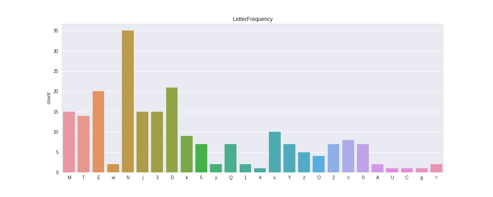

This is an example documentation file
=====================================

In this file we will explore things like adding images to your documentation, code blocks, links,
etc. 

In general, making pretty documentation that extends beyond just looking at the code.

Images
------

Pretty pictures are always helpful for explaining concepts!

Code blocks
-----------

With syntax highlighting!

Always useful for inline examples, though there's an argument for unit tests being used as
examples:

.. code-block:: c++

  // imagine this is absolutely sublime code
  #include <algorithm>
  #include "potato.h"
  #include <vector>

  int main() {
    int pheasant = 7;

    std::vector<int> coop; // where else do you keep your pheasants?
  
  }

.. code-block:: html

  <!DOCTYPE html>
  <html>
    <head>
      <title>Imagine I know what I'm doing</title>
    </head>

    <body>
      <h1> The life and death of javascript</h1>
    </body>
  </html>

Subheadings
+++++++++++

Like HTML, RST allows for different levels of headers. RST doesn't care what markers you use for
headers, just that you're consistent. As you use more bars that it hasn't seen it'll add more
header levels

For example;

This is H1
==========

This is H2
----------

This is H3
++++++++++

H4 is whatever we use next

This will be H4
***************

This could have been H4
#######################

You can also **bold** and *italicize* text

You can `link to places <http://www.google.com>`__

You can have blocks of commands::

    g++ -g -std=c++14 somefile
    gdb a.out
    valgrind a.out

